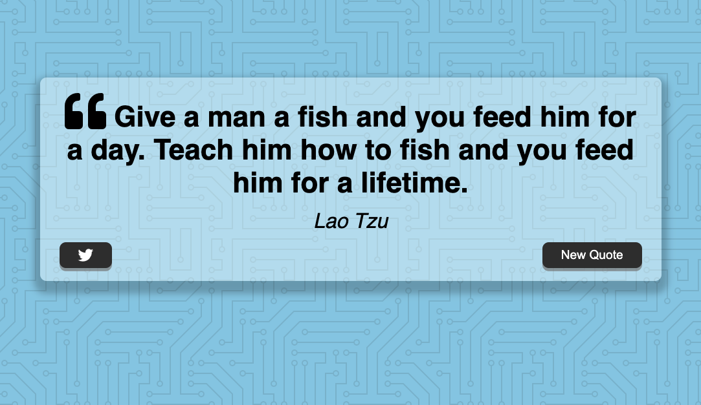
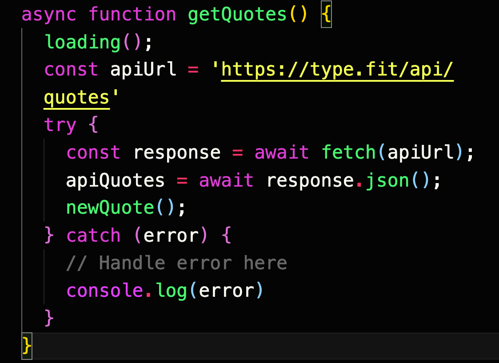

## Table of contents

- [Overview](#overview)
  - [Screenshot](#screenshot)
  - [What I learned](#what-i-learned)
  - [Continued Development](#continued-development)
## Overview

### Screenshot

### Built with
- HTML5 markup
- CSS 
- Flexbox
### What I learned

Gained more understanding of CSS flexbox. Also a simple way of using try/catch to manage data from API.

<h1>Some HTML code I'm proud of</h1>

### Continued development

I plan to keep practicing CSS Flexbox and CSS Grid

